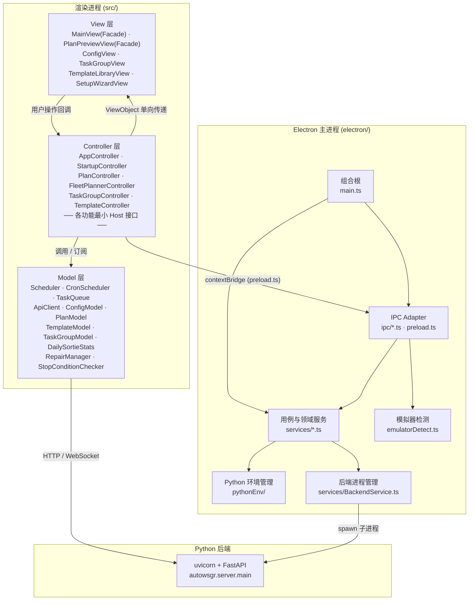
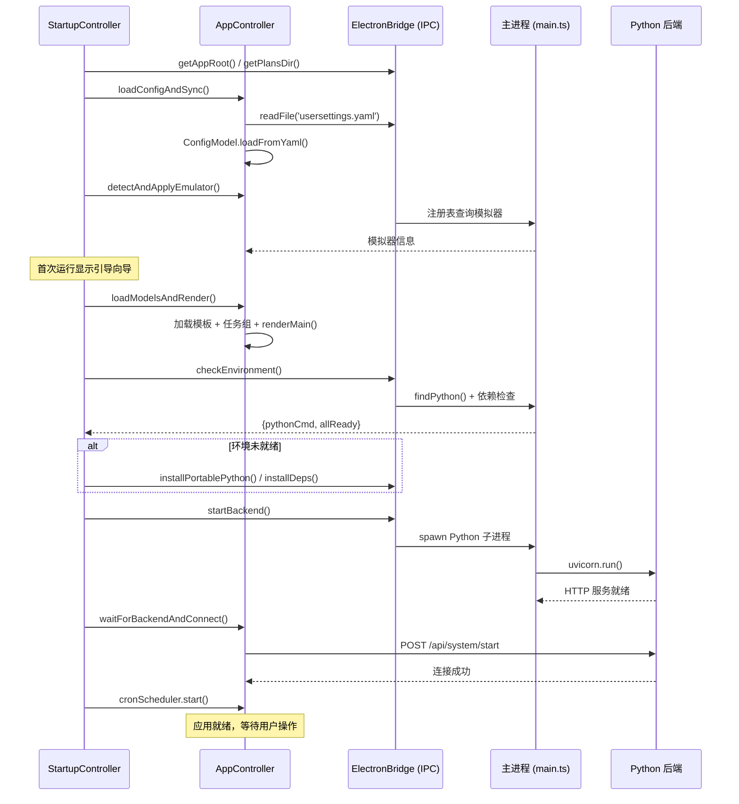

# AutoWSGR-GUI 总架构文档

## 项目简介

AutoWSGR-GUI 是一个基于 **Electron** 的桌面应用，为 [AutoWSGR](https://github.com/huan-yp/Auto-WSGR)（战舰少女R 自动化框架）提供图形化操作界面。

- **前端**：TypeScript，经典 MVC 架构，esbuild 打包
- **后端**：Python FastAPI + uvicorn，由 Electron 主进程作为子进程管理
- **通信**：Electron IPC（主进程 ↔ 渲染进程）+ HTTP/WebSocket（渲染进程 ↔ Python 后端）

---

## 整体分层架构



### 分层职责

| 层 | 位置 | 职责 |
|----|------|------|
| **View** | `src/view/` | 纯 UI 渲染，接收 ViewObject 显示；不含业务逻辑。大型视图采用 Facade 模式内部拆分 |
| **Controller** | `src/controller/` | 从 Model 提取数据 → 拼装 ViewObject → 调用 View 渲染；处理用户事件 → 调用 Model / Adapter。各功能声明自己的最小 Host |
| **Model** | `src/model/` | 业务实体 + 领域服务：调度、配置、方案、Fleet 规则、后端通信 |
| **Adapter** | `src/adapter/` | YAML/JSON、IPC、HTTP/WS 和浏览器存储边界 |
| **Types** | `src/types/` | API、IPC、Model、View、Scheduler 和 Statistics 六个领域类型文件 |
| **主进程** | `electron/` | `main.ts` 负责装配；`ipc/` 保持通道契约；`services/` 承担窗口、配置、计划、环境和后端用例 |
| **Python 后端** | 外部 | 游戏自动化核心逻辑：模拟器连接、战斗执行、OCR 识别 |

---

## 目录结构

```
AutoWSGR-GUI/
├── electron/                   # Electron 主进程
│   ├── main.ts                 # 组合根：依赖装配、IPC 注册、迁移与生命周期
│   ├── preload.ts              # contextBridge 安全 API 暴露
│   ├── emulatorDetect.ts       # 模拟器注册表检测
│   ├── ipc/                    # IPC Adapter，不实现领域规则
│   │   ├── FileIpc.ts          # 文件、路径和系统对话框
│   │   ├── DeviceIpc.ts        # 模拟器与 ADB
│   │   ├── ConfigurationIpc.ts # 同步 getter 与配置 setter
│   │   ├── TeamPlanIpc.ts      # 编队计划
│   │   ├── CombatPlanIpc.ts    # 作战计划
│   │   ├── DailyPlanIpc.ts     # 演习、战役和决战日常计划
│   │   ├── ShipLibraryIpc.ts   # 舰船资料库
│   │   ├── EnvironmentIpc.ts   # Python 环境
│   │   ├── BackendIpc.ts       # 后端进程
│   │   ├── UpdaterIpc.ts       # GUI 自动更新
│   │   └── IpcRegistrar.ts     # 最小注册接口
│   ├── services/               # 用例、领域和基础设施服务
│   │   ├── AppPaths.ts · SafePathService.ts · SecureFileService.ts
│   │   ├── AtomicFileStore.ts · GuiSettingsStore.ts
│   │   ├── WindowService.ts · SingleInstanceService.ts
│   │   ├── MigrationStateStore.ts · UserDataMigrationService.ts
│   │   ├── TeamPlanCodec.ts · TeamPlanRepository.ts · TeamPlanService.ts
│   │   ├── CombatPlanCodec.ts · CombatPlanRepository.ts
│   │   ├── RuntimePlanService.ts · PlanManagementService.ts
│   │   ├── DailyPlanService.ts
│   │   ├── ShipLibraryService.ts · ShipLibraryUpdater.ts
│   │   ├── AdbService.ts · CudaEnvironmentService.ts
│   │   ├── GuiConfigurationService.ts · PythonEnvironmentService.ts
│   │   ├── LegacyPlanMigration.ts
│   │   ├── BackendService.ts · BackendShutdownService.ts
│   │   └── GuiUpdatePolicy.ts  # 更新版本和频道策略
│   └── pythonEnv/              # Python 环境管理子模块
│       ├── backendRequirement.ts # 支持的后端版本范围
│       ├── backendContractProbe.ts # 外部后端能力探测
│       ├── context.ts          # 共享上下文与缓存状态
│       ├── dependencies.ts     # Python 依赖声明
│       ├── finder.ts           # Python 可执行文件发现
│       ├── environment.ts      # 统一安装、检查和启动环境
│       ├── cuda.ts             # CUDA 路径与环境变量
│       ├── envCheck.ts         # 环境验证主流程
│       ├── installer.ts        # Python 安装与依赖管理
│       ├── updater.ts          # autowsgr 自动更新
│       ├── utils.ts            # 工具函数与共享接口
│       └── index.ts            # 聚合导出
├── src/                        # 渲染进程 (MVC)
│   ├── controller/             # 控制器（6 个子目录）
│   │   ├── app/                # 应用控制器：AppController · SchedulerBinder · SchedulerRuntimeTracker · ScheduledTaskLoader
│   │   ├── startup/            # 启动流程：StartupController · connection · envAndUpdates
│   │   ├── plan/               # 方案控制器：PlanController · BattlePlanLoaderController · FleetPlannerController · DecisivePlanController
│   │   ├── taskGroup/          # 任务组：TaskGroupController · DailyTaskLoaderController · queueLoader
│   │   ├── template/           # 模板：TemplateController · crud · selectors · useTemplate · wizard
│   │   └── shared/             # 共享 UI 边界：DialogHelper
│   ├── adapter/                # YAML/JSON · IPC · HTTP/WS · Storage
│   ├── model/                  # 数据模型 + 业务服务
│   │   ├── fleet/              # FleetDraft · DecisiveFleetDraft · FleetPresetIdentity · FleetRuleMapper
│   │   ├── scheduler/          # 调度子模块：Scheduler · CronScheduler · TaskQueue · ExpeditionTimer · StopConditionChecker · RepairManager
│   │   ├── statistics/         # 今日出征统计
│   │   ├── ApiClient.ts        # HTTP/WebSocket 后端通信
│   │   ├── ConfigModel.ts      # 配置数据模型
│   │   ├── PlanModel.ts        # 方案解析/序列化
│   │   ├── TemplateModel.ts    # 模板管理
│   │   ├── TaskGroupModel.ts   # 任务组持久化
│   │   └── MapDataLoader.ts    # 地图数据加载与缓存
│   ├── view/                   # UI 视图（8 个子目录）
│   │   ├── main/               # 主页面 Facade：MainView · LogView · TaskQueueView · StatusBar
│   │   ├── plan/               # 方案与舰队：PlanPreviewView · FleetPlannerView · FleetEditorView · FleetGalleryView · PlanManagementView
│   │   ├── config/             # 配置页：ConfigView
│   │   ├── taskGroup/          # 任务组：TaskGroupView
│   │   ├── template/           # 模板：TemplateLibraryView · TemplateWizardView · SelectorDialog
│   │   ├── setup/              # 初始化向导：SetupWizardView
│   │   ├── shared/             # 共享组件：ShipAutocomplete · AnimatedSelect
│   │   └── styles/             # SCSS 样式（base/ · components/ · pages/）
│   ├── types/                  # 6 个按完整领域合并的类型文件
│   │   ├── api.ts              # API / WebSocket DTO
│   │   ├── ipc.ts              # IPC DTO、ElectronBridge 和 Window 声明
│   │   ├── model.ts            # Plan、Config、Template、Repair 领域类型
│   │   ├── view.ts             # 页面 ViewObject 和表单值
│   │   ├── scheduler.ts        # 调度器公共类型
│   │   └── statistics.ts       # 今日出征统计类型
│   ├── shared/                 # 决战、任务预设、胖次和舰种等跨层稳定契约
│   ├── data/                   # 舰船静态 JSON；运行时规则位于 model/fleet
│   └── utils/                  # 工具类（Logger）
├── resource/                   # 只读资源
│   ├── system_battle_plans/    # 系统作战计划 (.yaml)
│   ├── system_team_plans/      # 系统编队计划 (.yaml)
│   ├── system_daily_plans/     # 演习、战役和决战日常计划
│   ├── user_battle_plans/      # 兼容旧目录，运行时不写入
│   ├── user_team_plans/        # 兼容旧目录，运行时不写入
│   ├── migrations/v6/          # 已下架系统计划的只读迁移快照
│   ├── ship-library/           # 打包舰船资料库种子
│   ├── builtin_templates.json  # 内置模板
│   ├── maps/                   # 地图 JSON（节点坐标、连线）
│   └── images/                 # 图片资源
├── templates/                  # 用户自定义模板（历史兼容来源）
├── scripts/                    # 构建脚本
├── tools/                      # 独立开发者工具；仅明确白名单文件进入安装包
├── build/                      # electron-builder 配置
├── usersettings.yaml           # 历史兼容来源，运行时写入 userData
├── gui_settings.json           # 历史兼容来源，运行时写入 userData
├── task_groups.json            # 历史兼容来源，运行时写入 userData
└── package.json                # 项目配置
```

用户可变计划、舰队、日常计划、设置和迁移状态写入 Electron `userData`：
`user_battle_plans/`、`user_team_plans/`、`user_daily_plans/`、`gui_settings.json` 和
`.migration-state.json`。迁移账本由 `MigrationStateStore` 独占读写。安装目录和
`resource/` 只读；v5 迁移会合并当前
安装目录的旧设置、任务组和模板，递归识别有效计划 YAML，并按新规范重命名
后纳入 GUI 管理。不同内容的同名配置保存为“（旧版）”副本，源文件始终保留。
v6 继续升级系统预设库存、旧系统计划引用和胖次稳定计划标识，v7 再分类迁移
旧计划。每一阶段只有全部成功才写入独立完成键并推进版本；失败项在下次启动
重试。本次存在实际迁移项时，主窗口创建后会显示成功、失败数量和失败文件说明。

### 主进程依赖方向

```text
main.ts
  ↓
ipc/*Ipc.ts
  ↓
Service
  ↓
Codec / Repository
  ↓
AppPaths / SafePathService / AtomicFileStore
```

`main.ts` 不包含 IPC 业务分支，并在迁移旧配置前通过
`SingleInstanceService` 获取 Electron 单实例锁。重复启动的进程立即退出并通知
主实例恢复、显示和聚焦已有窗口，不会再次执行配置迁移、环境检查或 pip 安装。
可变状态有唯一所有者：后端子进程在 `BackendService`，资料库更新互斥在
`ShipLibraryUpdater`，运行时计划序号在 `RuntimePlanService`，Python 发现缓存
在 `pythonEnv/context.ts`。配置服务每次读取唯一的 `gui_settings.json`，不建立
第二份内存配置。

---

## 启动流程



---

## 关键架构模式

### 最小 Host 依赖注入

子控制器不直接依赖 `AppController`，而是在所属功能模块中声明最小 Host，例如：

```typescript
interface PlanHost {
  readonly scheduler: Scheduler;
  plansDir: string;
  renderMain(): void;
  switchPage(page: string): void;
}
```

`PlanHost`、`StartupHost`、`TaskGroupHost` 等接口彼此独立，不再存在通用
`ControllerHost` 基接口。详见 [Controller 层](01-controller-layer.md)。

### ViewObject 单向数据传递

Controller 从 Model 提取数据，拼装为 **ViewObject**（定义在
`src/types/view.ts`），单向传递给 View 渲染。View 不访问有状态 Model；类型、
不可变目录和无状态领域函数可以直接复用，但不能成为第二个状态所有者。

```
Model → Controller.extractViewObject() → ViewObject → View.render(vo)
```

### View Facade 模式

大型视图组件采用 Facade 模式：`MainView` 组合日志、队列和状态栏；
`PlanPreviewView` 组合地图和节点编辑；`FleetPlannerView` 组合舰队编辑、规则、
图鉴、计划管理和方案选择。普通舰队草稿只由 `FleetPlannerController` 的单个
`FleetDraft` 持有，决战草稿由 `DecisivePlanController` 的
`DecisiveFleetDraft` 独立持有。舰船库读取、编队计划 DTO 转换、保存覆盖和
`file/source` identity 都在 Controller/Model；Fleet View 只接收 ViewObject 和
不透明计划 ID，并上报用户意图。

### 优先级任务队列

`Scheduler` 实现三级优先级队列，保证远征收取不会被用户任务阻塞：

| 优先级 | 值 | 说明 |
|--------|---|------|
| `EXPEDITION` | 0 | 最高优先级：远征收取 |
| `USER_TASK` | 10 | 用户手动添加的战斗任务 |
| `DAILY` | 20 | 定时触发的日常任务 |

每个队列轮次使用独立 `id`，同一有限或无限任务的后触发轮次共享稳定
`logicalId`。单轮完成、逻辑任务完成和逻辑取消是三个不同事件，cron/pending
状态只在逻辑任务结束或明确取消时清理。

### 本地 Python 隔离

managed 模式和内置 Python 使用 `{appRoot}/python/site-packages/`；external
模式使用用户选定解释器时，依赖安装到该解释器自身环境。安装、依赖检查、
CUDA 检测和后端启动复用同一环境描述。通过 `.env_ready` 标记缓存已验证环境。

### 双层通信

- **IPC 层**：渲染进程 ↔ 主进程，用于文件 I/O、环境管理、系统对话框
- **HTTP/WS 层**：渲染进程 ↔ Python 后端，用于游戏操作和实时日志

---

## Types 层组织

类型定义从各模块提取为独立的 `src/types/` 层，按领域划分：

| 路径 | 内容 | 被谁引用 |
|------|------|----------|
| `api.ts` | API 响应、TaskRequest、WebSocket 消息类型 | ApiClient、Controller |
| `ipc.ts` | IPC DTO、`ElectronBridge` 与全局 Window 声明 | Adapter、Controller |
| `model.ts` | Plan、Config、Template、Repair 领域类型 | Model、Controller |
| `scheduler.ts` | 调度器：TaskPriority、SchedulerTask、SchedulerCallbacks | Scheduler、SchedulerBinder |
| `statistics.ts` | 今日出征次数、评级和掉落提示 | DailySortieStats、SchedulerBinder、View |
| `view.ts` | Main、Plan、Config、Template、TaskGroup ViewObject | Controller → View |

---

## 子模块文档导航

| 文档 | 功能域 |
|------|--------|
| [Controller 层](01-controller-layer.md) | 最小 Host 接口 · 6 个子目录结构 · StartupController 启动编排 |
| [任务调度系统](02-task-scheduling.md) | Scheduler · TaskQueue · CronScheduler · ExpeditionTimer · StopCondition · RepairManager |
| [配置系统](03-configuration.md) | ConfigModel · ConfigView · usersettings.yaml · gui_settings.json |
| [出击计划系统](04-battle-plan.md) | PlanModel · PlanController · PlanPreviewView(Facade) · MapDataLoader |
| [模板与任务组](05-template-and-taskgroup.md) | TemplateModel · TaskGroupModel · 创建向导 · 队列加载 |
| [后端通信](06-backend-communication.md) | IPC Bridge · ApiClient · REST API · WebSocket 事件 |
| [环境管理](07-environment-management.md) | Python 发现/安装 (pythonEnv/) · 模拟器检测 · 后端生命周期 |
| [开发环境搭建](08-dev-setup.md) | 依赖安装 · 开发/构建/打包命令 · SCSS 架构 · 调试技巧 |
| [`src` TypeScript 模块目录](09-src-typescript-catalog.md) | 当前 `src` 模块和逐文件职责；数量以该文档为准 |
| [当前运行时边界 ADR](10-runtime-boundaries-adr.md) | 存储 · IPC 权限 · 迁移 · 调度身份 · 更新安装决策 |
