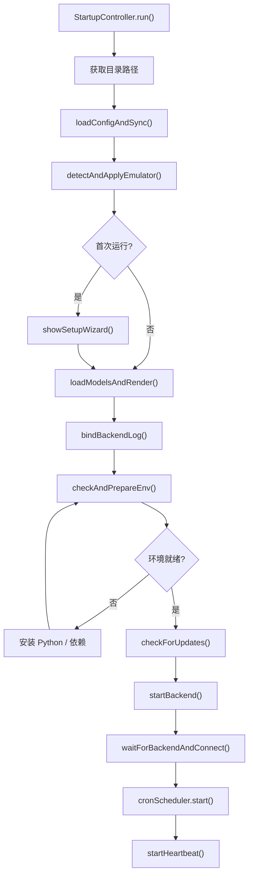
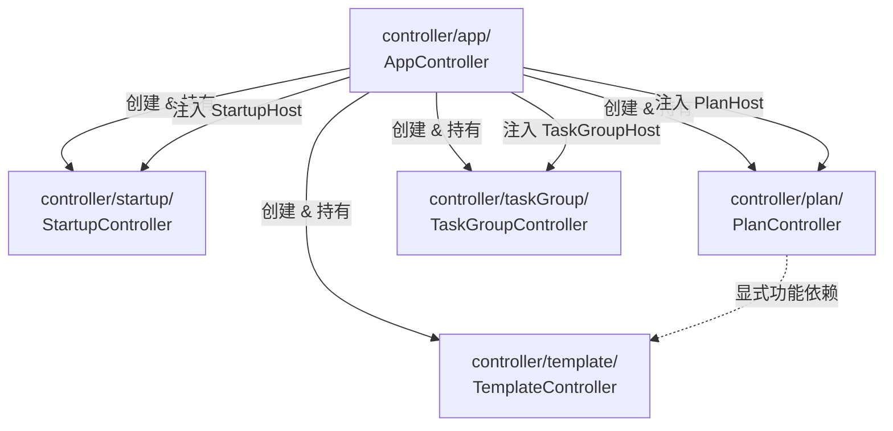

# Controller 层

> 涉及文件：`src/controller/` 的 6 个业务子目录

## 概述

Controller 层采用 **最小 Host 接口依赖注入** 模式组织。`AppController` 是唯一
Renderer 组合根，创建子控制器时传入只包含所需能力的对象。

每个子控制器内部进一步按职责拆分为多个模块文件，主控制器类保持精简（"瘦身版"），核心逻辑委托给同目录下的模块。

---

## 最小 Host 接口

```typescript
// src/controller/contracts.ts
interface PlanHost {
  readonly scheduler: Scheduler;
  plansDir: string;
  renderMain(): void;
  switchPage(page: string): void;
}
```

`StartupHost`、`PlanHost`、`TaskGroupHost` 集中定义在
`src/controller/contracts.ts`，流程模块只依赖这些最小能力，不反向导入主
Controller。接口彼此独立，不继承公共基接口；Controller 内部使用明确模块
路径，不通过 barrel 获取依赖。

---

## 子目录结构

### controller/contracts.ts — 编排契约

集中定义 Controller 流程模块使用的最小 Host 接口，避免
`queueLoader → TaskGroupController`、`presetFlow → PlanController` 等类型
反向依赖。对话框属于 View 能力，位于 `src/view/shared/DialogHelper.ts`。

---

### controller/app/ — 主控制器

顶层协调器，创建并持有所有子控制器实例，实现各 Host 接口。

| 文件 | 职责 |
|------|------|
| `AppController.ts` | 根控制器类：初始化子控制器、实现 Host 接口、协调全局状态 |
| `AutomaticDecisiveTask.ts` | 分别从用户决战计划和系统预设构造自动决战请求 |
| `CurrentFleetController.ts` | 读取舰船库并把当前任务舰队转换为主页面 ViewObject |
| `ConfigController.ts` | 配置保存逻辑：从表单收集 → 更新 ConfigModel → 同步 CronScheduler/Scheduler → 写文件 |
| `SettingsController.ts` | 设置页操作：环境与 ADB 检测、舰船库、更新检查和主题交互 |
| `NavigationController.ts` | 页面和方案标签导航 |
| `OperationsController.ts` | 远征收取和奖励领取等常用操作 |
| `SchedulerBinder.ts` | 绑定 Scheduler/CronScheduler 回调，按稳定 `logicalId` 管理等待任务并维护今日出征统计 |
| `rendering.ts` | 渲染分发：构建 `MainViewObject` → 调用 `MainView.render()` |
| `constants.ts` | 常量定义 |

导航、队列按钮、快捷操作、主题和浏览器生命周期事件由 `src/view` 持有。
Controller 只接收 View 上报的用户意图并编排用例。

**SchedulerBinder Host 接口**：

```typescript
interface SchedulerBinderHost {
  readonly scheduler: Scheduler;
  readonly cronScheduler: CronScheduler;
  readonly api: ApiClient;
  readonly templateModel: TemplateModel;
  readonly configModel: ConfigModel;
  renderMain(): void;
  updateOpsAvailability(connected: boolean): void;
}
```

---

### controller/startup/ — 启动流程

从 AppController 独立出来的启动编排控制器。

| 文件 | 职责 |
|------|------|
| `StartupController.ts` | 启动流程主编排，并持有后端心跳和自动重启定时器 |
| `envAndUpdates.ts` | 环境检查与更新：调用 IPC `checkEnvironment()` / `installDeps()` / `checkForUpdates()` |
| `connection.ts` | 后端连接：`waitForBackendAndConnect()` 轮询等待后端 HTTP 就绪，然后发送系统启动请求 |

**StartupHost 接口**（由 AppController 实现）：

```typescript
interface StartupHost {
  readonly scheduler: Scheduler;
  readonly cronScheduler: CronScheduler;
  readonly configModel: ConfigModel;
  appRoot: string;
  plansDir: string;
  configDir: string;

  syncPaths(appRoot: string, plansDir: string, configDir: string): void;
  initLogger(gateway: StartupGateway): void;
  loadConfigAndSync(): Promise<void>;
  detectAndApplyEmulator(): Promise<void>;
  showSetupWizard(): Promise<void>;
  loadModelsAndRender(gateway: StartupGateway): Promise<void>;
  reviewMigrationConflicts(): Promise<void>;
  bindBackendLog(gateway: StartupGateway): void;
  renderMain(): void;
  startHeartbeat(): void;
}
```

**启动时序**：



---

### controller/plan/ — 方案控制器

管理受管方案的新建、加载、编辑、保存和预览渲染。

| 文件 | 职责 |
|------|------|
| `PlanController.ts` | 方案子控制器类：持有当前方案状态，协调下属模块 |
| `BattlePlanLoaderController.ts` | 独立持有受管方案选择器状态，加载、筛选并返回最终选择 |
| `DecisivePlanController.ts` | 持有决战舰队草稿，协调设置读取、编辑和保存 |
| `FleetPlannerController.ts` | 持有普通舰队草稿，协调舰船库、计划持久化、覆盖冲突和文件 identity |
| `PlanFleetPresetController.ts` | 维护出征方案引用的舰队预设清单和只读 ViewObject |
| `PlanManagementController.ts` | 持有计划管理目录状态，编排导出、删除、重命名和打开操作 |
| `fleetViewObjects.ts` | 把舰队持久化对象映射为只读展示对象 |
| `planManagementViewObjects.ts` | 推导计划关联、缺失引用、任务组引用和删除影响 |
| `presetFlow.ts` | 任务预设的导入/查看/关闭/执行流程 |
| `nodeEditor.ts` | 节点编辑器：从 UI 收集节点阵型/夜战/索敌规则并写回 PlanData |
| `rendering.ts` | 构建 `PlanPreviewViewObject`，协调地图数据和方案数据的合并 |
| `selectedNodes.ts` | 规范化节点选择顺序并生成后端需要的节点列表 |

**PlanHost 接口**：

```typescript
interface PlanHost {
  readonly scheduler: Scheduler;
  plansDir: string;
  renderMain(): void;
  switchPage(page: string): void;
}
```

---

### controller/taskGroup/ — 任务组控制器

管理任务组的 CRUD、拖拽排序、队列加载。

| 文件 | 职责 |
|------|------|
| `TaskGroupController.ts` | 任务组子控制器类：绑定视图事件，协调下属模块 |
| `addItems.ts` | 向任务组添加项目：从当前方案/文件/预设添加 |
| `DailyTaskLoaderController.ts` | 管理日常任务浮窗的分类、参数和加入列表/队列动作 |
| `TaskListLoaderController.ts` | 解析外部任务列表并协调批量载入 |
| `managedPlanReader.ts` | 读取受管作战计划并统一用户/系统来源信息 |
| `queueLoader.ts` | 加载任务组到调度队列：逐项构建 TaskRequest → `Scheduler.addTask()` |
| `metaLoader.ts` | 加载任务项的元数据（方案标题、模板名称）用于 UI 显示 |
| `contextMenu.ts` | 右键上下文菜单：编辑/删除/复制任务项 |

**TaskGroupHost 接口**：

```typescript
interface TaskGroupHost {
  readonly scheduler: Scheduler;
  plansDir: string;
  renderMain(): void;
  switchPage(page: string): void;
  importTaskPreset(preset: TaskPreset, filePath: string): void;
  getCurrentPlan(): PlanModel | null;
  setCurrentPlan(plan: PlanModel, mapData: MapData | null): void;
  renderPlanPreview(): void;
  closePresetDetail(): void;
  executePreset(): void;
  getCurrentPresetInfo(): { preset: TaskPreset; filePath: string } | null;
  pickManagedBattlePlan(): Promise<ManagedBattlePlanSelection | null>;
  openManagedPlan(file: string, source: PlanPresetSource): Promise<boolean>;
}
```

---

### controller/template/ — 模板控制器

管理模板库的 CRUD、创建向导、使用模板。

| 文件 | 职责 |
|------|------|
| `TemplateController.ts` | 模板子控制器类：绑定库视图/向导视图事件 |
| `wizard.ts` | 4 步创建向导：选类型 → 配参数 → 设默认值 → 命名确认 |
| `useTemplate.ts` | "使用模板"流程：展示选项弹窗 → 添加到任务组 / 加入队列 / 直接执行 |
| `selectors.ts` | 选择弹窗：方案选择、战役选择、舰队选择、决战章节选择 |
| `crud.ts` | 模板的编辑/删除/重命名/批量导入 |

---

## 依赖关系



**关键设计**：共享能力通过最小 Host 注入；确有业务关系的模块使用明确 import 或
回调，不通过通用根控制器或隐藏 barrel 获取依赖。

---

## 与其他系统的关系

- **Model 层**：Controller 持有 Model 实例引用，通过 Model 的公共方法读写数据
- **View 层**：Controller 构建 ViewObject 传递给 View 渲染，View 通过回调将用户操作传回 Controller
- **IPC 层**：Adapter 独占 `window.electronBridge`；Controller 仅注入 `StartupGateway`、`ConfigurationGateway` 等窄能力
- **调度系统**：SchedulerBinder 封装 Scheduler/CronScheduler 的回调绑定；各子控制器通过 Host 的 `scheduler` 属性添加任务

`npm run test:controller-boundaries` 会扫描全部 Controller，禁止 DOM 全局、DOM
实现类型、浏览器事件所有权和直接 `window.electronBridge` 访问重新进入该层。
