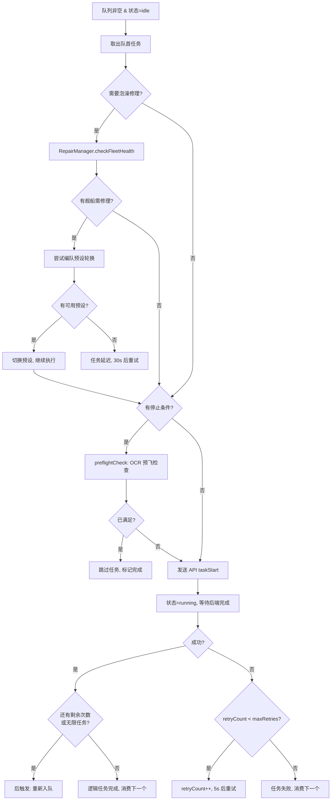
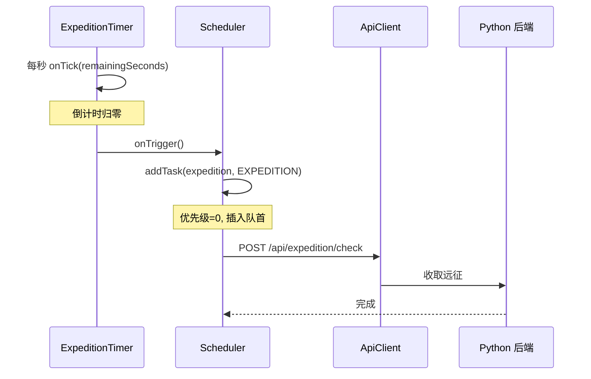
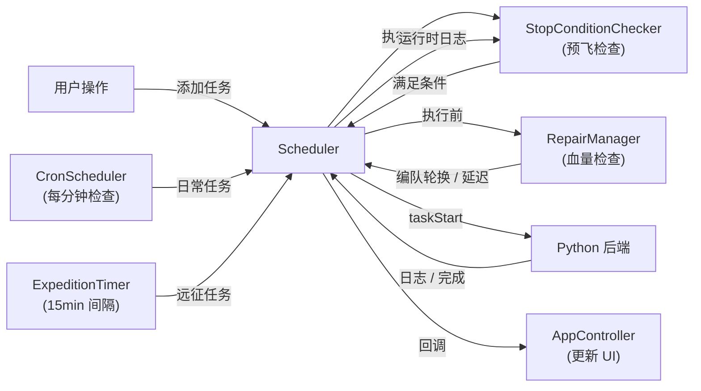

# 任务调度系统

> 涉及文件：`src/model/scheduler/` 子目录（Scheduler.ts · TaskQueue.ts · CronScheduler.ts · ExpeditionTimer.ts · StopConditionChecker.ts · RepairManager.ts）· `src/types/scheduler.ts`

## 概述

任务调度系统是 AutoWSGR-GUI 的核心运行引擎，负责将用户的战斗计划、日常自动化任务按优先级排队，逐个发送到 Python 后端执行。

调度模块位于 `src/model/scheduler/`，通过 `index.ts` 聚合导出（外部统一从 `'../model/scheduler'` 导入）。类型定义位于 `src/types/scheduler.ts`。

系统由六个组件构成：

| 组件 | 职责 |
|------|------|
| `Scheduler` | 核心调度器，管理任务消费/重试/后触发，持有 TaskQueue ||
| `TaskQueue` | 优先级任务队列数据结构，从 Scheduler 提取，封装入队/出队/查找操作 |
| `CronScheduler` | 基于系统时钟的定时触发器，在演习/战役/出击刷新时间自动生成任务 |
| `ExpeditionTimer` | 远征收取定时器，按固定间隔（默认 15 分钟）触发远征检查 |
| `StopConditionChecker` | 多阶段停止条件检查器，通过 OCR/日志/API 判断是否提前终止 |
| `RepairManager` | 泡澡修理管理器，检查舰船血量、送入泡澡、编队预设轮换 |

---

## 核心组件

### Scheduler — 优先级任务队列

`Scheduler` 采用**带优先级的生产者-消费者模型**，同一时间只有一个任务在后端执行。

#### 优先级体系

```typescript
// src/types/scheduler.ts
enum TaskPriority {
  EXPEDITION = 0,   // 远征检查（最高）
  USER_TASK  = 10,  // 用户手动发起的战斗
  DAILY      = 20,  // 日常自动任务
}
```

新任务按优先级值**升序插入**队列，确保远征检查不会被长时间的用户任务阻塞。

#### 任务结构

```typescript
interface SchedulerTask {
  id: string;              // 当前单轮的唯一标识
  logicalId: string;       // 所有后触发轮次共享的稳定逻辑任务标识
  name: string;            // 显示名称
  type: SchedulerTaskType; // normal_fight | campaign | exercise | decisive | expedition
  priority: TaskPriority;
  request: TaskRequest;    // 发送给后端的 API 请求体
  remainingTimes: number;  // 剩余执行次数
  totalTimes: number;      // 总次数（用于显示进度）
  unlimited?: boolean;     // 无限任务每轮后继续，但 logicalId 不变
  backendTaskId?: string;  // 当前轮对应的后端任务 ID
  stopCondition?: StopCondition;    // 可选的提前终止条件
  bathRepairConfig?: BathRepairConfig; // 可选的泡澡修理配置
  fleetPresets?: FleetPreset[];     // 可轮换的编队预设列表
  maxRetries: number;      // 最大重试次数（默认 2）
  retryCount: number;      // 当前已重试次数
}
```

#### 生产者

三类生产者向队列添加任务：
1. **用户手动**：通过 UI 选择受管方案或从任务组加载（`USER_TASK` 优先级）
2. **定时触发**：`CronScheduler` 生成演习、战役、出击、决战和胖次任务（`DAILY` 优先级）
3. **后触发**：单轮完成后按剩余次数或无限标记追加下一轮；新轮次生成新 `id`，但继承原 `logicalId`

#### 消费流程



---

### 任务身份与生命周期

调度器严格区分物理轮次和逻辑任务：

| 事件 | 标识 | 含义 |
|------|------|------|
| `onTaskCompleted` | `id` | 一轮后端任务结束，可继续生成后触发轮次 |
| `onLogicalTaskCompleted` | `logicalId` | 已无后触发、满足停止条件或重试耗尽，整个逻辑任务结束 |
| `onLogicalTaskCanceled` | `logicalId` | 用户删除、清空队列或系统停止；不等同于成功或失败 |

有限和无限任务的每个后触发轮次都有新的 `id`，但共享创建任务时生成的
`logicalId`。`SchedulerBinder` 只在逻辑完成时清理 cron/pending 状态；单轮
完成只重置当前进度。取消时还会根据原因区分行为：用户删除或清空表示主动
放弃，`system_stopped` 只释放 pending，允许下次启动重新触发。

延迟间隔、失败重试和修理等待中的任务也属于同一逻辑任务。删除或清空操作会
同时检查运行中、就绪队列和等待队列，保证一个 `logicalId` 的停止语义可追踪。

---

### CronScheduler — 定时触发

`CronScheduler` 每分钟检查一次系统时间，在特定时间点自动向 `Scheduler` 添加日常任务。

#### 触发规则

| 任务类型 | 触发时间 | 去重机制 |
|----------|----------|----------|
| 演习 | 0:00 / 12:00 / 18:00 后 | `localStorage` 记录**实际完成**时间戳 |
| 战役 | 每日 0:00 后 | `localStorage` 记录完成日期 (YYYY-MM-DD) |
| 常规出击 | 每分钟检查；调度器完全空闲时 | 单轮 pending；本轮全部逻辑任务结束后释放 |
| 决战 | 每日 0:00 后 | 实际任务结束后记录完成日期 |
| 刷战利品 | 每日 0:00 后 | 同上 |
| 定时方案 | YAML 中 `scheduled_time: "HH:MM"` | 当日 `firedToday` 标志 |

**关键设计**：记录的是任务**实际完成**的时间戳而非"是否已触发"。这样即使 App 因 ADB 断开等原因重启，只要任务未真正完成，下次启动后仍会补发。

自动决战固定生成一轮（`decisive_rounds: 1`），不查询或推测剩余票数。来源
只能是 `user_plan` 或 `system_preset`：前者读取决战计划页保存的
`decisive_plan`，后者读取只读系统预设 `builtin_decisive_6`。任务入队前读取
或配置失败会清除 pending，允许后续 tick 重试；逻辑任务实际结束后，无论成功
或失败，当天都不再重复，以免失败前已消耗票数。

自动出征只在 `Scheduler` 无运行、排队、重试等待或修理延迟任务时触发。每次
触发将配置中的所有 YAML 计划各加入一个单轮任务；计划加载期间如果调度器变为
非空闲，本轮不入队并等待下一次检查。

#### 事件回调

`CronScheduler` 通过回调通知 `AppController`，由 Controller 调用 `Scheduler.addTask()` 入队：

```typescript
import type { LootPlanSource } from '../../src/shared/lootPlans';
import type {
  DecisiveAutomationSource,
} from '../../src/shared/decisiveAutomation';

interface CronCallbacks {
  canStartNormalFight?: () => boolean;
  onExerciseDue?: (fleetId: number) => void;
  onCampaignDue?: (campaignName: string, times: number) => void;
  onNormalFightDue?: () => void;
  onDecisiveDue?: (source: DecisiveAutomationSource) => void;
  onLootDue?: (
    source: LootPlanSource,
    planId: string,
    stopCount: number,
  ) => void;
}
```

---

### ExpeditionTimer — 远征定时器

独立的间隔定时器，默认每 15 分钟触发一次远征收取检查。

- 间隔可配置（1~120 分钟，通过配置页设定）
- 每秒发出 `onTick` 回调用于 UI 倒计时显示
- 到期时发出 `onTrigger`，`Scheduler` 据此插入 `EXPEDITION` 优先级任务



---

### StopConditionChecker — 停止条件检查

支持两种停止条件：`loot_count_ge`（战利品数量 ≥ N）和 `ship_count_ge`（舰船数量 ≥ N）。

检查分三个阶段：

| 阶段 | 时机 | 数据来源 | 说明 |
|------|------|----------|------|
| **预飞 (preflight)** | 任务发送前 | `GET /api/game/acquisition` (OCR) | 已满足则跳过任务 |
| **运行时 (running)** | 任务执行中 | 后端日志 `[UI] 战利品数量: N/M` | 实时解析日志触发停止 |
| **任务后 (post)** | 单轮完成后 | `GET /api/game/context` | 决定是否继续后触发 |

---

### RepairManager — 泡澡修理

在任务执行前检查编队舰船血量，将受损舰船送入泡澡修理。

#### 修理流程

1. **血量检查**：调用 `GET /api/game/context` 获取编队舰船 HP
2. **阈值匹配**：按舰船名查找修理阈值配置（支持"·改"名称规范化）
3. **送入泡澡**：调用 `POST /api/repair` 发送修理请求
4. **编队轮换**：若有多组 `FleetPreset`，尝试切换到未受损的预设继续战斗
5. **延迟重试**：若无可用预设，任务延迟 30 秒后重新检查

```typescript
interface BathRepairConfig {
  enabled: boolean;
  defaultThreshold: RepairThreshold;  // 默认修理阈值
  shipThresholds?: Record<string, RepairThreshold>; // 按舰船名定制阈值
}
```

---

## 组件交互全景



---

## 与其他系统的关系

- **Controller 层**：`SchedulerBinder` 绑定 Scheduler/CronScheduler 回调并管理待完成任务 ID；`SchedulerRuntimeTracker` 持有日志派生的主页运行状态；`ScheduledTaskLoader` 负责读取自动化计划并入队
- **配置系统**：开关类后端设置来自 `usersettings.yaml.daily_automation`；远征间隔、战役次数、自动决战和胖次设置来自 `gui_settings.json.automation`
- **模板与任务组**：任务组通过 `loadGroupToQueue()`（`controller/taskGroup/queueLoader.ts`）批量向 `Scheduler` 添加任务
- **出击计划**：方案解析后构建 `TaskRequest`，通过 `Scheduler.addTask()` 入队
- **后端通信**：`Scheduler` 持有 `ApiClient` 引用，通过 REST API 发起任务、通过 WebSocket 接收进度和完成通知
