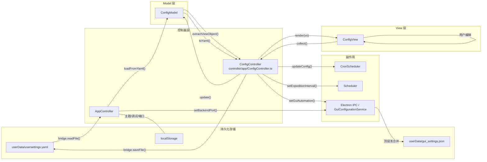

# 配置系统

> 涉及文件：`src/model/ConfigModel.ts` · `src/view/config/ConfigView.ts` · `src/view/theme.ts` · `src/controller/app/ConfigController.ts` · `src/types/model.ts` · `electron/services/GuiSettingsStore.ts` · `electron/services/GuiConfigurationService.ts` · `electron/ipc/ConfigurationIpc.ts`

## 概述

配置系统采用**双层存储**：

| 层级 | 文件 | 内容 | 读写方式 |
|------|------|------|----------|
| **GUI 级** | `userData/gui_settings.json` | 后端、Python、CUDA、窗口和 GUI 自动化设置 | Electron 配置服务读写 |
| **用户级** | `userData/usersettings.yaml` | 模拟器、账号、日常自动化 | 渲染进程通过 IPC 读写 |

另外，主题/调试模式等纯 UI 偏好存储在浏览器 `localStorage` 中。

---

## 数据模型

### UserSettings 结构

```typescript
interface UserSettings {
  emulator: EmulatorConfig;
  account: AccountConfig;
  daily_automation: DailyAutomation;
}
```

#### EmulatorConfig — 模拟器配置

| 字段 | 类型 | 说明 |
|------|------|------|
| `type` | `string` | 模拟器类型：`"MuMu"` / `"雷电"` / `"蓝叠"` 等 |
| `path` | `string?` | 模拟器可执行文件路径 |
| `serial` | `string?` | ADB 连接串口，如 `"127.0.0.1:16384"` |

#### AccountConfig — 账号配置

| 字段 | 类型 | 说明 |
|------|------|------|
| `game_app` | `string` | 服务器：`"官服"` 等 |
| `account` | `string?` | 账号 |
| `password` | `string?` | 密码 |

#### DailyAutomation — 日常自动化

| 字段 | 类型 | 默认 | 说明 |
|------|------|------|------|
| `auto_expedition` | `boolean` | `false` | 自动远征 |
| `auto_gain_bonus` | `boolean` | `false` | 自动领取奖励 |
| `auto_bath_repair` | `boolean` | `false` | 自动浴室修理 |
| `auto_set_support` | `boolean` | `false` | 自动设置支援 |
| `bath_repair_blacklist` | `string[]` | `[]` | 浴室修理黑名单 |
| `auto_exercise` | `boolean` | `false` | 自动演习 |
| `exercise_fleet_id` | `number?` | `null` | 演习舰队 (1~4) |
| `auto_battle` | `boolean` | `false` | 自动战役 |
| `battle_type` | `string` | `"困难潜艇"` | 战役类型 |
| `auto_normal_fight` | `boolean` | `false` | 自动常规出击 |
| `normal_fight_tasks` | `NormalFightTaskConfig[]` | `[]` | 自动出击任务及顺序 |
| `quick_repair_limit` | `number?` | `null` | 快修限制 |
| `stop_max_ship` | `boolean` | `false` | 船坞满时停止 |
| `stop_max_loot` | `boolean` | `false` | 战利品满时停止 |

#### GuiAutomationSettings — GUI 自动化

这些字段仅属于 GUI 调度器，保存在 `gui_settings.json.automation`，不会写回
`usersettings.yaml`：

| 字段 | 类型 | 默认 | 说明 |
|------|------|------|------|
| `expeditionInterval` | `number` | `15` | 远征检查间隔（分钟，1~120） |
| `battleTimes` | `number` | `3` | 每日战役次数 |
| `autoDecisive` | `boolean` | `false` | 每日自动决战 |
| `decisiveTemplateId` | `string` | `"builtin_decisive_6"` | 决战模板 ID |
| `autoLoot` | `boolean` | `false` | 每日自动刷胖次 |
| `lootPlanId` | `string` | 内置稳定 ID | 系统出征计划文件名 |
| `lootStopCount` | `number` | `50` | 胖次停止数量（1~50） |

旧版 YAML 中的 `expedition_interval`、`battle_times`、胖次字段和决战字段会在
启动时迁移。`auto_decisive` 与 `decisive_template_id` 升级为正式 automation；
`decisive_ticket_reserve` 只原样归档到 `legacy_decisive_automation`，不参与
执行轮数。独立的 `decisive_plan` 不会被旧字段覆盖。

---

## ConfigModel

`ConfigModel` 是配置数据的内存表示，提供加载/更新/序列化接口：

| 方法 | 说明 |
|------|------|
| `loadFromYaml(yamlStr)` | 解析 YAML 字符串，与默认值合并（缺失字段保留默认） |
| `toYaml()` | 序列化为 YAML 字符串 |
| `update(partial)` | 深合并部分更新 |
| `current` | 只读属性，返回当前 `UserSettings` 对象 |

**关键行为**：`loadFromYaml` 对缺失字段做**默认值回填**，确保旧版配置文件升级后新字段不会为 `undefined`。

---

## 数据流



### 加载流程

1. `AppController.loadConfigAndSync()` 通过 IPC 读取 `usersettings.yaml`
2. 调用 `ConfigModel.loadFromYaml()` 解析并合并默认值
3. 若文件不存在，用默认值创建新文件

### 保存流程

1. 用户点击“保存配置”
2. `ConfigView.collect()` 从表单提取当前值 → `ConfigViewObject`
3. `ConfigController.saveConfig()` 执行以下操作：
   - 在候选 `ConfigModel` 中校验并合并表单字段
   - 通过 `ConfigurationGateway.commitGuiSettings()` 提交 YAML、GUI 设置和窗口偏好
   - Main 进程先写 YAML，再原子提交 JSON；JSON 失败时恢复原 YAML
   - 提交成功后才更新内存模型和 `localStorage` UI 偏好
   - 同步 `CronScheduler.updateConfig()` 更新定时任务规则
   - 同步 `Scheduler.setExpeditionInterval()` 更新远征检查间隔

### 主题管理

主题 DOM 逻辑位于 `view/theme.ts`，通过 `StorageAdapter` 读取偏好，支持亮色、
暗色、自动切换和强调色应用。

---

## ConfigView 表单结构

配置页 UI 分为三个区域，对应 `UserSettings` 的三个子配置：

### 模拟器设置
- 模拟器类型下拉 (`#cfg-emu-type`)
- 安装路径 (`#cfg-emu-path`) + 文件浏览按钮
- ADB 串口 (`#cfg-emu-serial`) + 自动检测按钮

### 账号设置
- 服务器选择 (`#cfg-game-app`)
- 账号/密码（可选）

### 自动化设置
- 远征开关 + 间隔滑块
- 演习开关 + 舰队选择
- 战役开关 + 类型 + 次数
- 决战开关 + 模板选择（下拉从 `TemplateModel` 动态填充）
- 战利品开关 + 方案 + 停止数量

### 附加设置（localStorage 存储）
- 主题模式：自动 / 亮色 / 暗色
- 强调色
- 调试模式
- 后端端口

---

## gui_settings.json

由 Electron 主进程直接管理的配置，位于 Electron `userData`：

```json
{
  "backend_port": 8438,
  "python_path": "",
  "update_mode": "auto",
  "backend_startup_mode": "managed",
  "backend_repo_path": "",
  "ocr_gpu_mode": "auto",
  "cuda_path": "",
  "save_backend_screenshots": false,
  "automation": {
    "expeditionInterval": 15,
    "battleTimes": 3,
    "autoDecisive": false,
    "decisiveTemplateId": "builtin_decisive_6",
    "autoLoot": false,
    "lootPlanId": "bettle-old-8-5AI六潜胖次.yaml",
    "lootStopCount": 50
  }
}
```

- `backend_port`：Python 后端 HTTP 服务端口
- `python_path`：用户手动指定的 Python 路径（空字符串 = 自动检测）
- `backend_startup_mode`：`managed` 使用 GUI 管理的环境，`external` 使用指定仓库
- `ocr_gpu_mode` / `cuda_path`：OCR GPU 模式与 CUDA 路径
- `automation`：GUI 私有自动化设置
- `decisive_plan`：决战计划页单独维护的当前配置
- `legacy_decisive_automation`：旧决战字段无损归档
- `window`：窗口位置与尺寸偏好

`GuiSettingsStore` 是唯一 JSON 存储入口，每次写入执行顶层浅合并，因此未参与
本次更新的未知顶层字段不会丢失。`GuiConfigurationService` 负责默认值、边界、
旧决战字段迁移和 Python 缓存清理；`ConfigurationIpc` 只保持通道契约。

渲染进程通过 `get-backend-port-sync`、`get-python-path-sync` 等同步 getter
读取启动配置，通过 `set-backend-port`、`set-python-path` 等异步 setter 写入。
同步 getter 必须继续使用 `ipcMain.on` / `sendSync`，不能改成 Promise。

---

## 与其他系统的关系

- **任务调度**：`daily_automation` 提供后端自动化开关和出击任务；`automation` 提供远征间隔、战役次数、自动决战和胖次参数
- **环境管理**：`gui_settings.json` 中的 `python_path` 影响 Python 发现优先级
- **后端通信**：`backend_port` 决定 `ApiClient` 的连接地址
- **模拟器检测**：初始化时若 `emulator` 字段为空，自动调用 `detectEmulator()` 填充
