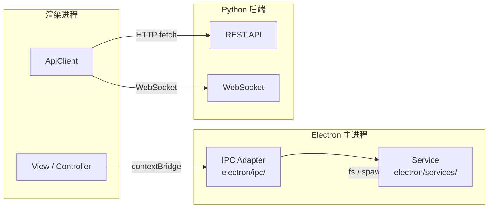
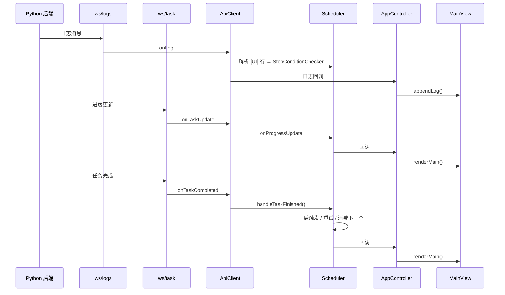

# 后端通信

> 涉及文件：`electron/preload.ts` · `electron/main.ts`（组合根）· `electron/ipc/` · `electron/services/` · `src/model/ApiClient.ts` · `src/types/api.ts` · `src/types/ipc.ts`

## 概述

AutoWSGR-GUI 的通信分为**两层**：



| 层 | 路径 | 用途 |
|----|------|------|
| **IPC** | 渲染进程 ↔ Electron 主进程 | 文件 I/O、系统对话框、环境管理、后端进程控制 |
| **HTTP/WS** | 渲染进程 ↔ Python 后端 | 游戏操作、任务执行、实时日志 |

---

## IPC 通信层

external 后端模式使用用户指定的本地 AutoWSGR 仓库。路径不存在、仓库结构
无效或缺少 `autowsgr/server/main.py` 时启动明确失败，不会静默回退到 managed
后端；检测和实际启动使用同一解释器与环境变量。

### 暴露机制

`preload.ts` 通过 Electron 的 `contextBridge.exposeInMainWorld()` 安全地将 IPC 方法暴露到 `window.electronBridge` 对象上。渲染进程只能通过预定义的方法调用主进程，无法直接访问 Node.js API。

### Adapter 组织

`main.ts` 只创建 Service 并调用注册函数。通道按领域位于
`electron/ipc/`：`FileIpc`、`DeviceIpc`、`ConfigurationIpc`、
`TeamPlanIpc`、`CombatPlanIpc`、`DailyPlanIpc`、`ShipLibraryIpc`、
`EnvironmentIpc`、`BackendIpc` 和 `UpdaterIpc`。

Adapter 允许处理 Electron 对话框、同步 `event.returnValue` 和边界异常转换，
但不得实现配置默认值、YAML 解析、路径规则或进程状态。同步 getter 使用
`ipcMain.on`，其余调用使用 `ipcMain.handle`；通道名、参数顺序和返回结构属于
兼容性契约，由 `scripts/test-main-ipc.js` 自动与 `preload.ts` 对照。

### API 分类

#### 文件操作

| 方法 | 参数 | 返回 | 说明 |
|------|------|------|------|
| `readFile(path)` | 受控路径 | `string` | 只读取 `userData` 或打包后的 `resource/` |
| `saveFile(path, content)` | 受控路径 + 内容 | `void` | 只写入 `userData` |
| `appendFile(path, content)` | 受控路径 + 内容 | `void` | 只追加到 `userData` |
| `openFileDialog(filters, defaultDir?)` | 文件过滤器 | `{path, content} \| null` | 打开文件选择对话框 |
| `saveFileDialog(name, content, filters)` | 默认名 + 内容 | `string \| null` | 保存文件对话框 |
| `openDirectoryDialog(title?)` | 对话框标题 | `string \| null` | 文件夹选择 |

通用文件 IPC 先拒绝 `..`、UNC、盘符相对路径和 NTFS ADS，再使用
`path.resolve` 与 `realpath` 展开现有祖先中的目录链接，最后验证 canonical
目标仍位于对应允许根目录。安装资源目录只读；renderer 不能通过
`saveFile` 或 `appendFile` 修改它。文件选择和保存对话框属于用户在当前操作
中明确确认的外部文件能力，不复用通用文件 IPC 的路径参数。

#### 作战计划管理

| 方法 | 返回 | 说明 |
|------|------|------|
| `getPlanManagement()` | `PlanManagementResult` | 汇总系统和用户计划清单 |
| `exportUserPlans(selections)` | `UserPlanExportResult` | 将勾选的用户计划按类型打包为 ZIP |
| `importLocalCombatPlan()` | `PlanFileOperationResult` | 选择本地 YAML，升级后写入用户受管目录 |
| `readManagedCombatPlan(source, file)` | `PlanFileOperationResult` | 读取受管计划并生成运行时展开文件 |
| `saveManagedCombatPlan(...)` | `PlanFileOperationResult` | 保存计划并拆分内嵌舰队 |

`importLocalCombatPlan()` 的文件路径仅在主进程对话框和计划服务之间传递。
渲染进程不能提交外部绝对路径；冲突覆盖也由主进程在同一次用户操作中确认。
`exportUserPlans()` 只接收计划类型和文件名，主进程从用户受管目录重新定位并
校验文件；系统预设不能导出，ZIP 输出路径由保存对话框授权。

#### 日常计划管理

| 方法 | 说明 |
|------|------|
| `listDailyPlans()` | 合并只读系统计划和用户计划，同名时用户版本优先 |
| `readDailyPlan(source, file)` | 按受管来源和文件名读取日常计划 |
| `getDailyDecisivePlan(chapter)` | 读取用户优先的指定章节决战计划 |
| `getSystemDailyDecisivePlan(chapter)` | 读取只读系统决战计划 |
| `saveDailyDecisivePlan(settings)` | 写入 `userData/user_daily_plans/` 并同步决战设置 |

`DailyPlanService` 只接受演习、战役和决战三类计划。Renderer 只提交受管来源、
文件名或结构化设置，不能把任意路径传给日常计划 IPC。

#### 路径查询

| 方法 | 返回 | 说明 |
|------|------|------|
| `getAppRoot()` | `string` | 应用工作目录 |
| `getPlansDir()` | `string` | 方案文件目录 |
| `getConfigDir()` | `string` | 配置文件目录 |
| `listPlanFiles()` | `{name, file}[]` | 列出方案文件 |
| `resolveAppPath(path)` | `string` | 仅解析 `userData` 或只读 `resource/` 内的路径 |
| `openFolder(path)` | `void` | 仅打开 `userData` 内经过 canonical 校验的目录 |

#### 环境管理

| 方法 | 返回 | 说明 |
|------|------|------|
| `checkEnvironment()` | `{pythonCmd, pythonVersion, missingPackages, allReady}` | 检查 Python 环境 |
| `installDeps()` | `{success, output}` | 安装 Python 依赖 |
| `installPortablePython()` | `{success}` | 安装便携版 Python |
| `checkUpdates()` | - | preload 兼容入口，主进程 handler 当前停用 |
| `pullUpdates()` | - | preload 兼容入口，主进程 handler 当前停用 |

#### Python 路径配置

| 方法 | 说明 |
|------|------|
| `getPythonPath()` | 同步获取用户配置的 Python 路径（`null` = 自动检测） |
| `setPythonPath(path)` | 设置 Python 路径并清除缓存 |
| `validatePython(path)` | 验证指定路径的 Python 版本是否兼容 |

#### 后端控制

| 方法 | 说明 |
|------|------|
| `startBackend()` | 启动 Python 后端子进程 |
| `detectEmulator()` | 自动检测模拟器 |
| `checkAdbDevices()` | 查询 ADB 设备列表 |
| `runSetup()` | 运行 setup.bat 脚本 |

#### GUI 自动更新

| 方法 | 说明 |
|------|------|
| `checkGuiUpdates()` | 检查 GUI 应用更新 |
| `downloadGuiUpdate()` | 下载更新包 |
| `installGuiUpdate()` | 安装更新并重启 |
| `onUpdateStatus(callback)` | 监听更新状态变化 |

`checkGuiUpdates()` 返回严格三态，不允许把异常当成“最新版”：

```typescript
type GuiUpdateCheckResult =
  | { status: 'available'; version: string }
  | { status: 'up-to-date' }
  | { status: 'error'; message: string };
```

`GuiUpdatePolicy` 根据当前应用版本选择并校验频道：稳定版 `X.Y.Z` 使用
`latest`，预发布版 `X.Y.Z-beta.N` 使用 `beta`，开发版 `X.Y.Z-dev` 或
`X.Y.Z-dev.N` 使用 `dev`。候选版本不属于当前频道时检查失败，不允许回退
读取其他频道清单。

安装更新前，`UpdaterIpc` 必须等待共享的 `stopBackend()` 完成。关闭流程依次
调用后端 `/api/system/stop`、终止服务进程树、等待 `close`；超时后才强制
终止并再次等待。任何阶段无法确认进程树退出都会返回错误并阻止
`quitAndInstall()`，避免任务运行中安装或 Windows 文件锁损坏升级。

#### 事件监听

| 方法 | 事件 | 说明 |
|------|------|------|
| `onBackendLog(callback)` | `backend-log` | 接收 Python 后端日志 |
| `onSetupLog(callback)` | `setup-log` | 接收 setup.bat 输出 |

#### 同步方法

| 方法 | 说明 |
|------|------|
| `getAppVersion()` | 同步获取应用版本号 |
| `getBackendPort()` | 同步获取后端端口 |
| `setBackendPort(port)` | 设置后端端口 |

---

## HTTP REST API

`ApiClient` 封装与 Python 后端的所有 HTTP 通信。

### 基础配置

- 默认地址：`http://localhost:8438`
- 端口可通过 `gui_settings.json` 配置
- 所有请求/响应使用 JSON 格式

### 统一响应结构

```typescript
interface ApiResponse<T = unknown> {
  success: boolean;
  data?: T;
  message?: string;
  error?: string;
}
```

### 端点列表

#### 系统管理

| 方法 | 端点 | 超时 | 说明 |
|------|------|------|------|
| POST | `/api/system/start` | 300s | 连接模拟器 + 启动游戏 |
| POST | `/api/system/stop` | - | 优雅停止当前系统任务并释放后端资源 |
| GET | `/api/system/status` | - | 系统状态查询 |
| GET | `/api/system/emulator/devices` | 15s | ADB 设备列表 |

#### 任务执行

| 方法 | 端点 | Body | 说明 |
|------|------|------|------|
| POST | `/api/task/start` | `TaskRequest` | 启动战斗/演习/战役/决战 |
| POST | `/api/task/stop` | - | 停止当前任务 |
| GET | `/api/task/status` | - | 当前任务状态 |

`TaskRequest` 为联合类型，支持 5 种任务：

```typescript
type TaskRequest =
  | NormalFightReq   // {type: 'normal_fight', plan, times, gap}
  | EventFightReq    // {type: 'event_fight', plan, times}
  | CampaignReq      // {type: 'campaign', campaign_name, times}
  | ExerciseReq      // {type: 'exercise', fleet_id}
  | DecisiveReq      // {type: 'decisive', chapter, level1, level2}
```

#### 远征

| 方法 | 端点 | 说明 |
|------|------|------|
| POST | `/api/expedition/check` | 收取所有已完成的远征 |

#### 游戏状态

| 方法 | 端点 | 返回数据 | 说明 |
|------|------|----------|------|
| GET | `/api/game/context` | 编队/资源/远征/建造槽 | 全局游戏状态 |
| GET | `/api/game/acquisition` | 战利品/舰船 OCR 数量 | 出征面板读数 |

#### 操作端点

| 方法 | 端点 | 说明 |
|------|------|------|
| POST | `/api/build/collect` | 收取建造 |
| POST | `/api/build/start` | 开始建造 |
| POST | `/api/reward/collect` | 收取每日奖励 |
| POST | `/api/cook` | 食堂烹饪 |
| POST | `/api/repair/bath` | 浴室快速修理 |
| POST | `/api/repair/ship` | 单船泡澡修理 |
| POST | `/api/destroy` | 解体舰船 |

#### 健康检查

| 方法 | 端点 | 说明 |
|------|------|------|
| GET | `/api/health` | 后端健康状态、运行时间 |

---

## WebSocket 通信

`ApiClient` 维护两条 WebSocket 连接，支持断线自动重连（3 秒延迟）：

### 连接

| 路径 | 用途 |
|------|------|
| `ws://localhost:8438/ws/logs` | 实时日志流 |
| `ws://localhost:8438/ws/task` | 任务进度 + 完成通知 |

### 消息类型

```typescript
// 日志消息 (/ws/logs)
interface WsLogMessage {
  type: 'log';
  timestamp: string;
  level: string;
  channel: string;
  message: string;
}

// 任务进度更新 (/ws/task)
interface WsTaskUpdate {
  type: 'task_update';
  task_id: string;
  status: string;
  progress?: { current: number; total: number; node: string | null };
}

// 任务完成 (/ws/task)
interface WsTaskCompleted {
  type: 'task_completed';
  task_id: string;
  success: boolean;
  result?: TaskResult;
  error?: string;
}
```

### 数据流



---

## 与其他系统的关系

- **任务调度**：`Scheduler` 持有 `ApiClient` 实例，通过 REST API 发起/停止任务，通过 WebSocket 接收进度和完成通知
- **配置系统**：`backend_port` 配置决定 `ApiClient` 的连接地址
- **环境管理**：所有环境相关操作（Python 检测/安装、后端启停）通过 IPC 层完成
- **出击计划**：方案数据被构建为 `CombatPlanReq` 嵌入 `TaskRequest` 中
