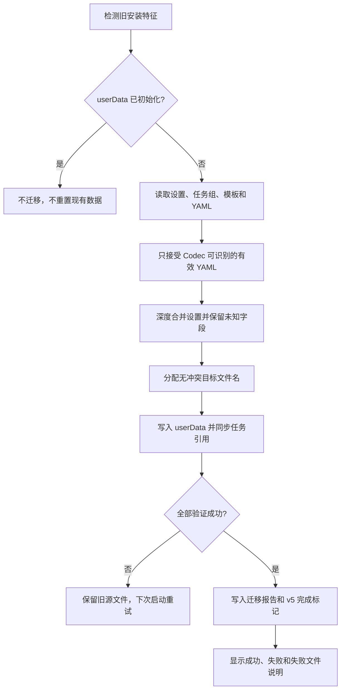
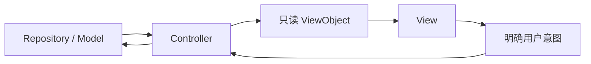

# GUI 2.0.0-alpha PR 前项目说明

> 目标版本：`GUI 2.0.0-alpha`  
> 更新频道：`alpha`  
> 目标平台：Windows 10/11 x64  
> 文档范围：新增功能、优化功能、兼容性、架构拆分和发布验收

## 1. 升级结论

GUI 2.0 不只是界面换肤。本次升级把舰队、出征计划、任务列表、用户设置和
AutoWSGR 运行环境整理为可校验、可迁移、可维护的完整流程，主要解决旧版以下问题：

- 系统资源、用户配置和运行时临时文件边界不清。
- 舰队主选、候选和出征计划引用难以通过界面可靠维护。
- 页面直接承担持久化、关系推导或业务状态，修改容易造成状态不同步。
- Controller 之间存在反向依赖，模块难以独立测试。
- 旧安装目录更换、同名文件冲突和任务引用升级缺少完整闭环。
- 发布频道、后端版本和内置资源缺少自动化一致性验收。

因此 GUI 2.0 的必要性来自数据可靠性、兼容性和维护成本，而不是单纯增加功能。

## 2. 新增功能

### 2.1 作战页

- 展示当前任务、进度、剩余次数、运行状态和远征倒计时。
- 展示任务中能够可靠识别的最多六艘当前舰船。
- 统一任务分组、任务队列、快捷操作和后端日志。
- 受管计划在执行前展开为后端可消费的完整运行时 YAML。

### 2.2 舰队规划

- 使用内置舰船资料库展示舰船立绘、舰种、国籍和稀有度。
- 支持搜索、多选筛选、改造过滤和排序。
- 支持六个主选位置及每个位置的独立候选队列。
- 支持主选、候选和图鉴之间拖放。
- 支持纯候选位置、等级限制、候选复制和两种候选跟随方式。
- 支持系统方案只读、另存个人副本和同名覆盖确认。

舰队 YAML 继续遵守 AutoWSGR 契约：一份文件只保存一支舰队，
`candidates` 必须是含 `name` 的对象；位置允许没有顶层 `name`，但必须有非空候选。

### 2.3 出征规划与计划管理

- 可视化编辑地图、执行参数、停止条件、维修策略和节点行为。
- 一个出征计划可以引用多个独立舰队方案。
- 计划管理统一展示系统/用户出征计划、舰队方案、任务分组引用和读取错误。
- 支持搜索、筛选、跳转编辑、导出、重命名、删除及忽略未关联提示。
- 删除舰队前展示被引用影响，避免无提示破坏现有计划。

### 2.4 设置与环境

- 支持模拟器检测、ADB 连接状态和后端环境检查。
- `managed` 模式管理内置 Python 与 AutoWSGR 依赖。
- `external` 模式连接用户本地 AutoWSGR 仓库和 Python 环境。
- 支持亮色、暗色、跟随系统主题和窗口状态持久化。
- 支持 OCR、自动任务、脚本延迟、维修和日志等后端配置。
- 保留 GUI 尚未识别的 YAML 扩展字段，降低升级时的数据损失风险。

## 3. 优化功能

### 3.1 保存语义

所有保存入口统一为：

```text
输入校验
→ Repository / IPC 写入
→ 原子替换成功
→ 更新文件身份和保存快照
→ 显示成功提示
```

点击按钮不再等同于保存成功。任一阶段失败时只显示错误，不显示成功提示。

### 3.2 文件与更新安全

- IPC 不接受任意绝对路径，只允许受管目录和受控文件身份。
- 路径校验拒绝 `..`、盘符跳转、UNC、符号链接和 Junction 逃逸。
- 关键 JSON/YAML 使用临时文件加重命名的原子写入。
- 系统方案只读；修改时保存为用户方案，不覆盖安装资源。
- 安装更新前先请求后端优雅退出，再终止进程树并等待文件锁释放。
- 无法确认后端停止时阻止安装更新。

### 3.3 代码简化

- 删除无页面入口的出征直接执行链。
- 删除未使用的 `FleetEditDialog`、修理刷新方法、迁移辅助类型和调试草稿。
- Scheduler 复用统一的后续任务构造策略。
- TaskQueue 复用统一的维修等待时间算法。
- 删除已停用的整块注释代码和重复舰名工具。
- 严格 TypeScript 未使用声明检查已清零。

## 4. 兼容性方案

### 4.1 用户数据隔离

GUI 2.0 将数据分为三类：

| 类型 | 位置 | 策略 |
| --- | --- | --- |
| 系统资源 | 安装包 `resource/` | 只读，随版本更新 |
| 用户数据 | Electron `userData` | 可写，升级不覆盖 |
| 运行时文件 | 进程临时目录 | 执行结束后可清理 |

用户数据包括：

- `usersettings.yaml`
- `gui_settings.json`
- `task_groups.json`
- `user_battle_plans/`
- `user_team_plans/`
- `user_daily_plans/`

### 4.2 旧配置自动迁移

完整迁移只在 `userData` 尚未初始化，且旧 EXE 目录存在旧安装特征时启动。
迁移流程为：



同名不同内容的文件保存为“（旧版）”副本，任务引用同步更新；旧源文件始终保留。
设置合并顺序为“新版本默认值 → 旧版已有值 → 旧版未知扩展字段”。

### 4.3 旧任务和稳定标识

- 旧 path-form 任务仍可加载，并逐步转换为 `managedSource + managedFile`。
- “刷胖次”使用稳定计划标识，不再依赖数组下标。
- 旧数字索引通过明确映射迁移。
- `fleet_presets` 始终按列表解析。
- 旧字符串候选只用于兼容读取，新保存统一输出结构化候选。
- 系统预设只读；用户修改保存为个人副本。

### 4.4 兼容方案优势

- 更换安装目录不会重置已经初始化的用户数据。
- 系统资源更新与用户配置互不覆盖。
- 旧版未知字段继续保留，减少后端配置丢失。
- 迁移失败可重试，且不修改旧源文件。
- 同名冲突有明确副本和人工确认，不静默覆盖。
- 任务引用与文件身份同步迁移，避免只迁移文件不迁移使用关系。

### 4.5 兼容方案代价

- 首次迁移需要扫描和验证旧文件，启动时间会增加。
- 同名冲突可能产生“（旧版）”副本，需要用户检查取舍。
- 无法通过当前 Codec 的损坏或非计划 YAML 不会自动迁移。
- `managed` 安装包不预装 `site-packages`，首次环境准备依赖网络。
- Alpha 频道用于提前验证升级行为，不承诺与稳定版相同的成熟度。

这些代价是显式保留用户数据和避免错误覆盖的结果，不能通过静默猜测消除。

## 5. 架构拆分

### 5.1 拆分前

部分页面同时持有可写业务状态、读取 Repository、推导关系和执行文件操作。
Controller 流程模块还会反向依赖主 Controller，形成循环依赖。典型风险是：

- View 和 Model 同时修改同一份草稿。
- 页面重建后持久化身份丢失。
- 计划管理关系计算散落在 DOM 渲染代码中。
- 测试必须构造完整页面或 Electron bridge。
- 修改一个流程容易连带影响组合根。

### 5.2 拆分后



主要边界：

| 模块 | 唯一职责 |
| --- | --- |
| `FleetPlannerController` | 持有唯一 `FleetDraft` 和持久化身份 |
| `FleetDraftEditor` | 对草稿执行一个显式编辑意图 |
| `PlanFleetPresetController` | 管理出征计划关联的舰队目录 |
| `PlanManagementController` | 编排计划目录操作和对话框 |
| `planManagementViewObjects` | 纯函数推导计划、舰队和任务组关系 |
| `CurrentFleetController` | 解析当前任务舰队并读取舰船资料 |
| `controller/contracts.ts` | 跨流程最小 Host 能力 |
| `View` | 渲染 ViewObject 并上报用户意图 |

结果：

- `src/view` 不直接依赖 Adapter、Model、Controller、Repository 或 Electron bridge。
- Controller 依赖图无循环。
- 舰队草稿和计划舰队列表都有唯一状态所有者。
- 关系推导可使用纯数据进行测试。
- IPC、Repository 和对话框依赖可以按最小接口注入。

### 5.3 后续维护方式

新增或修改功能时按以下顺序定位：

1. 后端模型或 YAML 契约变化：先更新 `types`、Codec 和契约测试。
2. 文件或主进程能力变化：更新 `electron/services`，再由最小 IPC 暴露。
3. 页面业务流程变化：更新对应 Controller 和 ViewObject 转换。
4. 交互变化：View 只新增用户意图和渲染，不直接访问 Repository。
5. 共享规则只有跨模块且无状态时才放入 `shared`。
6. 新模块必须通过 View 边界扫描、依赖无环检查和严格 TypeScript 检查。

这使维护者能够按职责找到唯一修改位置，减少重复实现和跨层联动。

## 6. 发布资源

GUI 2.0.0-alpha 安装包应包含：

| 内容 | 发布策略 |
| --- | --- |
| AutoWSGR-GUI | 打入 `app.asar` 和 Windows 可执行文件 |
| Python 3.12 与 pip | 内置便携运行时 |
| AutoWSGR 主库 | 首次联网安装锁定提交，不污染系统 Python |
| ADB | 内置 |
| VC++ Redistributable | 内置 |
| Maps | 内置全部地图资源 |
| 系统出征计划 | 内置 10 份 YAML |
| 系统舰队方案 | 内置 9 份 YAML |
| 系统日常计划 | 内置 20 份 YAML |
| 舰船资料库 | 内置 manifest、标签和 932 个资源文件 |
| 用户配置 | 不打包，由 `userData` 持久化 |

AutoWSGR 锁定提交为：

```text
b0f473fb1ec5318c2c4cff4795a804a3d2dd25bd
```

锁定提交确保 GUI 与后端运行契约一致。缺点是后端更新必须先完成兼容验证并修改
明确来源，不能自动追随未知版本。

## 7. Alpha 版本与频道

- `package.json` 和 `package-lock.json` 版本均为 `2.0.0-alpha`。
- electron-builder 发布频道为 `alpha`。
- 更新策略识别 `X.Y.Z-alpha` 和 `X.Y.Z-alpha.N`。
- Release workflow 生成 `alpha.yml`，并保持 `latest/beta/dev` 频道互斥。
- Alpha 版本不得进入稳定版 `latest.yml`。

## 8. 发布门禁

已通过：

- 严格 TypeScript 编译和未使用声明检查。
- Fleet 领域测试。
- Scheduler 领域测试。
- View 跨层依赖扫描。
- TypeScript 依赖图循环检查。
- SCSS 构建。
- `git diff --check`。

发布前仍必须通过：

- Electron main services、main IPC 和更新安全测试。
- 旧配置、旧计划和旧任务组迁移测试。
- 设置持久化和 Python 环境测试。
- `npm run dist`。
- `npm run test:release-package`。
- `AutoWSGR-GUI-Setup-2.0.0-alpha.exe`、`alpha.yml` 和解包资源人工复核。

未通过全部门禁前，PR 可以审查，但不应标记为可发布。
